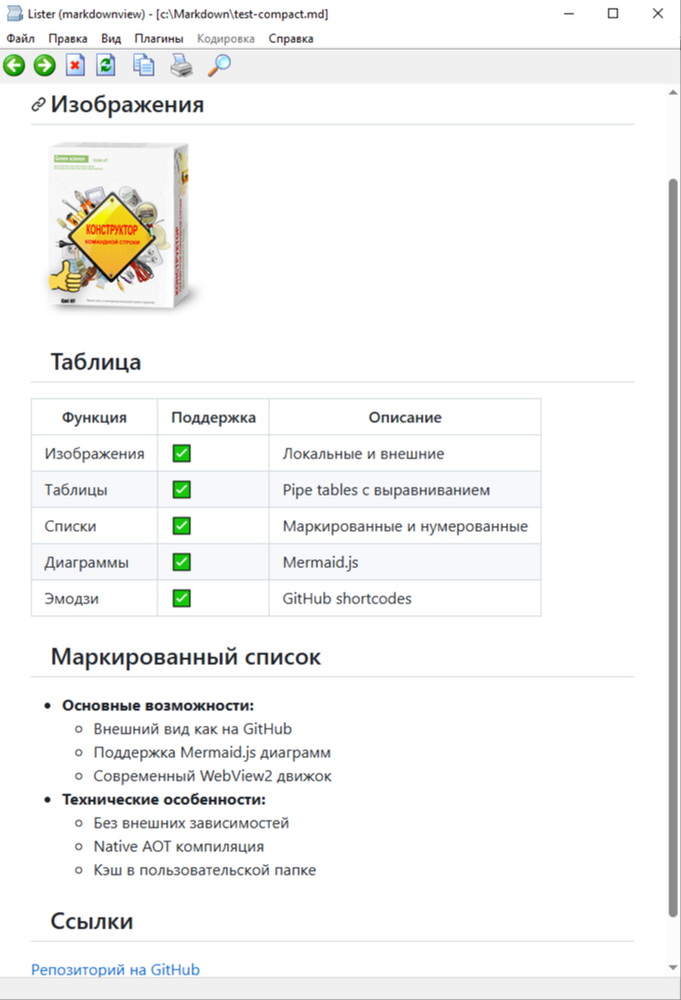

# Markdown Lister Plugin для Total Commander

> **Read this in other languages:** [English](README.en.md) | Русский

Плагин для просмотра Markdown файлов в Total Commander с современными возможностями и внешним видом как на GitHub.



## ✨ Основные возможности

- **Внешний вид полностью соответствует отображению на GitHub** - принимается за эталонное
- **Диаграммы Mermaid.js** - Полная поддержка блок-схем, диаграмм последовательности, ER-диаграмм и других
- **Изображения** - Отображение встроенных изображений и внешних изображений по URL
- **Таблицы** - Полная поддержка pipe-таблиц с выравниванием
- **Эмодзи** - Эмодзи в стиле GitHub через shortcodes (`:emoji_name:`)
- **Списки задач** - Интерактивные чекбоксы для отслеживания задач
- **Подсветка кода** - Синтаксическая подсветка для блоков кода
- **Математические формулы** - Математические выражения в стиле LaTeX
- **Перевод страницы** - Опциональный перевод через Google Translate

## 🚀 Ключевые преимущества

- **Без внешних зависимостей** - Не требует установки .NET Runtime
- **Современный движок WebView2** - На базе Chromium вместо устаревшего Internet Explorer
- **Быстрая и легкая работа** - Оптимизировано для производительности

## 📦 Установка

1. Скачайте архив из [Releases](https://github.com/Serg2000Mr/wlx-markdown-viewer-github-style/releases)
2. Откройте архив в Total Commander
3. Подтвердите установку плагина

## 🧪 Тестирование

Вы можете протестировать плагин с примерами файлов в папке `Примеры`.

## 🎨 Темы оформления

Плагин поддерживает несколько CSS тем:
- **GitHub** (по умолчанию) - классический вид GitHub
- **GitHub Dark** - темная тема GitHub
- **GitHub Retro** - ретро стиль GitHub
- **Air** - чистый и минималистичный
- **Modest** - простой и элегантный
- **Splendor** - богатый и красочный

## ⚙️ Конфигурация

Настройка осуществляется через файл `MarkdownView.ini`:

```ini
[Renderer]
CustomCSS=css\github.css
CustomCSSDark=css\github.dark.css

[Translate]
Enabled=0
Auto=0
Target=auto
```

## 🔍 Масштабирование

- **Ctrl + колесо мыши** - Увеличение/уменьшение масштаба документа
- **Ctrl + 0** - Сброс масштаба к 100%
- Удобно для чтения документов с мелким текстом или детальных диаграмм

## 🔧 Технические детали

### Архитектура

1. **Движок рендеринга (C# Native AOT)**:
   - Расположение: `MarkdigNative/`
   - Библиотека: [Markdig](https://github.com/xoofx/markdig)
   - Технология: .NET 8 Native AOT (компиляция Ahead-of-Time)
   - Результат: `MarkdigNative-x64.dll` (автономная нативная DLL без требования .NET runtime)
   - Экспорты: `ConvertMarkdownToHtml`, `FreeHtmlBuffer`

2. **Мостовой слой (чистый C++)**:
   - Расположение: `Markdown/`
   - Роль: Посредник между плагином Lister и AOT движком
   - Загрузка: Использует динамическую загрузку (`LoadLibraryW`) для поиска AOT DLL относительно своего пути
   - Совместимость: Заменяет старую реализацию C++/CLI для устранения зависимостей управляемого кода

3. **Плагин Lister (C++)**:
   - Расположение: `MarkdownView/`
   - Роль: Реализация интерфейса Total Commander
   - Технология: Чистый Win32 C++ с WebView2
   - Возможности: Загрузка файлов, интеграция WebView2, управление конфигурацией

### Требования для сборки

- Visual Studio 2022+ с рабочей нагрузкой C++ (Desktop development with C++)
- .NET 8 SDK
- WebView2 SDK (включен через NuGet)

Примечание: проекты C++ используют Platform Toolset `v145`. Если у вас установлен другой toolset, откройте `MarkdownView.sln` и выполните Retarget Projects.

### Процесс сборки

```bash
# Сборка всех компонентов
BuildAll.bat

# Или сборка по отдельности:
# 1. Сборка .NET AOT компонента
dotnet publish MarkdigNative/MarkdigNative.csproj -c Release

# 2. Сборка C++ компонентов
msbuild MarkdownView.sln /p:Configuration=Release /p:Platform=x64
```

## 📋 Системные требования

- Windows 10 или Windows 11
- WebView2 Runtime (обычно уже установлен на современных Windows)
- Total Commander 9.0 или новее

## 🤝 Участие в разработке

Приветствуются вклады в проект! Не стесняйтесь создавать issues и pull requests.

## � Контрибьюторы

- **[ezyuzin](https://github.com/ezyuzin)** - Автор версии с поддержкой Markdig и WebView2
- **[rg-software](https://github.com/rg-software)** - Автор оригинального wlx-markdown-viewer
- **[Serg2000Mr](https://github.com/Serg2000Mr)** - Текущий мейнтейнер, Native AOT версия

## 🙏 Благодарности

- **ezyuzin** за улучшенную версию [wlx-markdown-viewer](https://github.com/ezyuzin/wlx-markdown-viewer) с поддержкой Markdig
- **rg-software** за оригинальный [wlx-markdown-viewer](https://github.com/rg-software/wlx-markdown-viewer) 
- **xoofx** за процессор [Markdig](https://github.com/xoofx/markdig)

## 📄 Лицензия

Этот проект распространяется под лицензией MIT.
