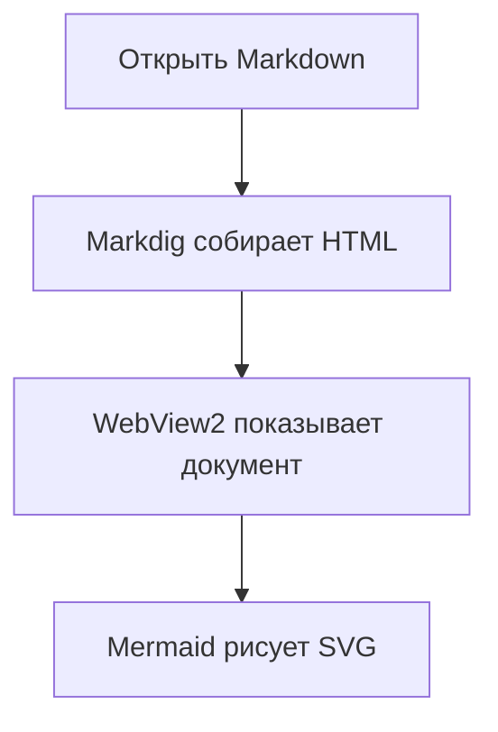
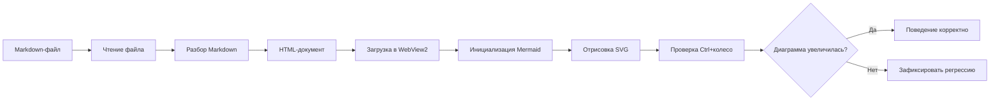
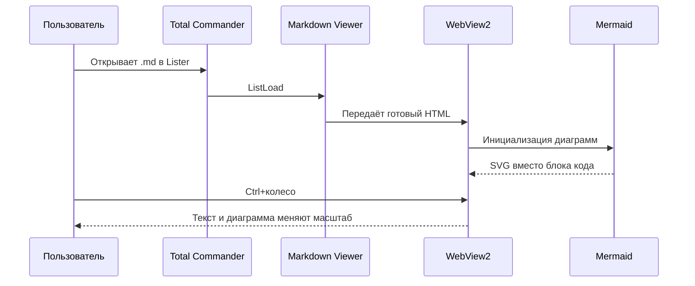

# Проверка масштаба Mermaid

Этот файл нужен для ручной проверки: при `Ctrl+колесо` должен увеличиваться не только обычный текст, но и Mermaid-диаграммы ниже.

## Простая диаграмма

## Широкая диаграмма

## Диаграмма последовательности

## Что проверить

- [ ] На месте блоков кода появились диаграммы, а не текст Mermaid.
- [ ] При увеличении масштаба обычный текст становится крупнее.
- [ ] При увеличении масштаба диаграммы тоже становятся крупнее.
- [ ] Если широкая диаграмма не помещается, её всё равно можно рассмотреть без обрезания важного текста.
